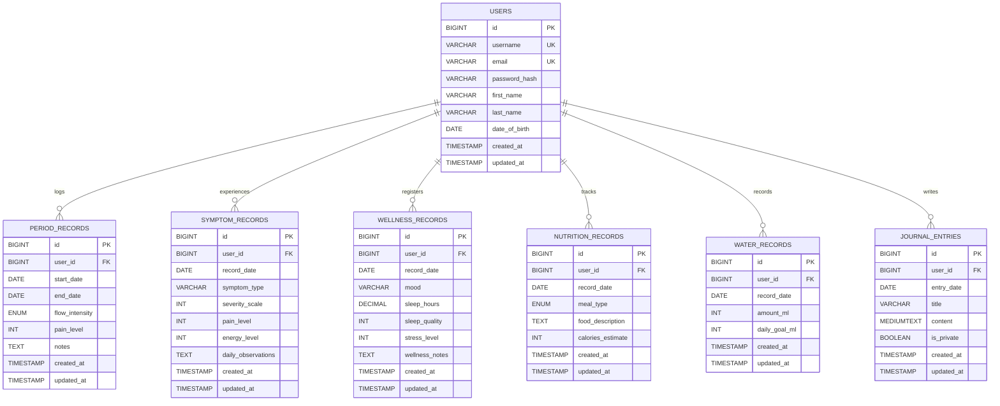

# HER HEALTH JOURNEY – Entity Relationship (ER) Diagram

```mermaid
erDiagram
    USERS ||--o{ PERIOD_RECORDS : logs
    USERS ||--o{ SYMPTOM_RECORDS : experiences
    USERS ||--o{ WELLNESS_RECORDS : registers
    USERS ||--o{ NUTRITION_RECORDS : tracks
    USERS ||--o{ WATER_RECORDS : records
    USERS ||--o{ JOURNAL_ENTRIES : writes

    USERS {
        BIGINT id PK
        VARCHAR username UK
        VARCHAR email UK
        VARCHAR password_hash
        VARCHAR first_name
        VARCHAR last_name
        DATE date_of_birth
        TIMESTAMP created_at
        TIMESTAMP updated_at
    }

    PERIOD_RECORDS {
        BIGINT id PK
        BIGINT user_id FK
        DATE start_date
        DATE end_date
        ENUM flow_intensity
        INT pain_level
        TEXT notes
        TIMESTAMP created_at
        TIMESTAMP updated_at
    }

    SYMPTOM_RECORDS {
        BIGINT id PK
        BIGINT user_id FK
        DATE record_date
        VARCHAR symptom_type
        INT severity_scale
        INT pain_level
        INT energy_level
        TEXT daily_observations
        TIMESTAMP created_at
        TIMESTAMP updated_at
    }

    WELLNESS_RECORDS {
        BIGINT id PK
        BIGINT user_id FK
        DATE record_date
        VARCHAR mood
        DECIMAL sleep_hours
        INT sleep_quality
        INT stress_level
        TEXT wellness_notes
        TIMESTAMP created_at
        TIMESTAMP updated_at
    }

    NUTRITION_RECORDS {
        BIGINT id PK
        BIGINT user_id FK
        DATE record_date
        ENUM meal_type
        TEXT food_description
        INT calories_estimate
        TIMESTAMP created_at
        TIMESTAMP updated_at
    }

    WATER_RECORDS {
        BIGINT id PK
        BIGINT user_id FK
        DATE record_date
        INT amount_ml
        INT daily_goal_ml
        TIMESTAMP created_at
        TIMESTAMP updated_at
    }

    JOURNAL_ENTRIES {
        BIGINT id PK
        BIGINT user_id FK
        DATE entry_date
        VARCHAR title
        MEDIUMTEXT content
        BOOLEAN is_private
        TIMESTAMP created_at
        TIMESTAMP updated_at
    }
```

